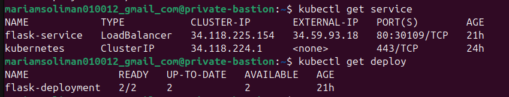
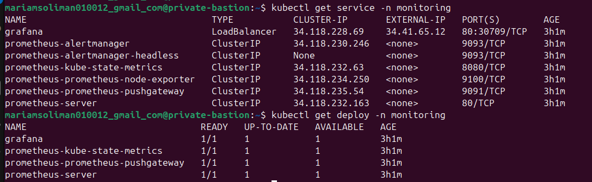
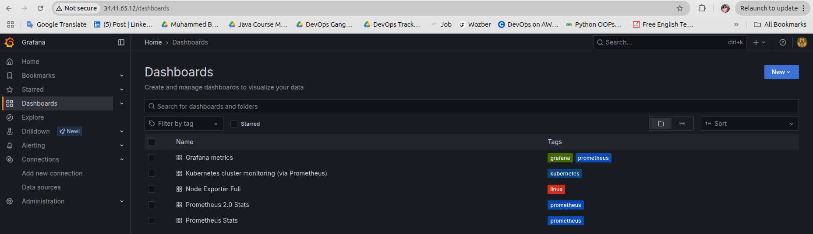

# DevOps Project with Flask App

A demonstration project integrating a Flask web application with a DevOps pipeline, infrastructure as code, containerization, monitoring, and orchestration.

## Overview

This project showcases how to build, deploy, and manage a Flask-based web application using modern DevOps practices. It includes:

- Dockerization of the app  
- Infrastructure provisioning with Terraform  
- Kubernetes manifests for deployment  
- CI/CD workflows (GitHub Actions or other)  
- Monitoring and logging stack  
- Best practices for versioning, automation, and reproducibility

---

## Architecture

Here’s a high-level view of how the system is organized:

1. The **Flask app** is packaged into a Docker container  
2. Infrastructure (e.g. cloud resources, networking) is defined in **Terraform**  
3. Kubernetes manifests (in `k8s/`) deploy the app on a cluster  
4. CI/CD pipelines automate build → test → deploy  
5. Monitoring stack captures metrics and logs (e.g. Prometheus, Grafana)

You can extend or swap out any component (for example use Helm charts, or another tooling stack).

---

## Repository Structure

📂 Project Structure
.
├── .github/workflows/app-pipeline.yaml
├── app/
│   ├── routes/
│   ├── services/
│   └── main.py
│   └── _init_.py
├── k8s/
│   ├── deployment.yaml
│   ├── service.yaml
│   └── namespace.yaml
├── terraform/
│   ├── gke.tf
│   ├── iap.tf
│   └── instance.tf
│   └── nat.tf
│   └── provider.tf
│   └── router.tf
│   └── nat.tf
│   └── service_account.tf
│   └── subnet.tf
│   └── automation.tpl
├── Helm_charts/
│   ├── prometheus/
│   └── grafana/
├── Screenshots/
├── run.py
├── requirements.txt
├── Dockerfile
└── README.md

---

- **app/** — contains your Flask app modules, routes, templates, static files  
- **k8s/** — manifests for deploying the app (Deployments, Services, Namespace)  
- **monitoring-stack/** — configuration files for your observability tools (Helm charts for Prometheus & Grafana)
- **terraform/** — Infrastructure-as-a-Code to provision GKE, networking, Bastion host, etc.  
- **Dockerfile** — instructions to build the Flask app image  
- **run.py** — entry point to run the Flask app  
- **requirements.txt** — Python dependencies  

---

_______________________________________________________________________________________________________________
☁️ Kubernetes Cluster Provisioning

Managed via Terraform in the terraform/ directory:
terraform init
terraform plan
terraform apply -auto-approve
terraform destroy -auto-approve

Creates GKE private cluster with all the needed networks, and Bation host to connect to the private Gke cluster via iap.
The Apply and Destroy enabled with a flag.
_______________________________________________________________________________________________________________
🚀 Application Deployment

Kubernetes manifests are in k8s/:
    deployment.yaml – The flask App
    service.yaml – LoadBalancer t expose the flask app
    namespace.yaml - the monitoring namespace

Deploy with:
        kubectl apply -f ./deployment.yaml
        kubectl apply -f ./service.yaml
        kubectl apply -f ./namespace.yaml
_______________________________________________________________________________________________________________
🌍 External Access to the Flask App

$ kubectl get service

NAME            TYPE           CLUSTER-IP       EXTERNAL-IP   PORT(S)        AGE
flask-service   LoadBalancer   34.118.225.154   34.59.93.18   80:30109/TCP   21h
kubernetes      ClusterIP      34.118.224.1     <none>        443/TCP        23h

✅ App URL: http://34.59.93.18/

_______________________________________________________________________________________________________________
🔁 CI/CD with GitHub Actions

Workflow located at .github/workflows/app-pipeline.yaml automates:
    - Cloning the repo
    - Docker build & dockerhub push 
    - Terraform provisioning (with Flag)
    - App deployment using connecting to the Bation host via iap for secure connection.
    - Helm install of Prometheus and Grafana
_______________________________________________________________________________________________________________
📊 Monitoring Stack

Monitoring stack was deployed in "monitoring" namespace    
    Commands used with helm to install via Bation host
        - helm install prometheus ./prometheus -n monitoring
        - helm install grafana ./grafana -n monitoring

Prometheus
    Prometheus added as data source in grafana (through grafana portal) with below URL:
        http://34.118.232.163

Grafana Exposed via LoadBalancer
    $ kubectl get svc -n monitoring
    NAME                                  TYPE           CLUSTER-IP       EXTERNAL-IP   PORT(S)        AGE
    grafana                               LoadBalancer   34.118.228.69    34.41.65.12   80:30709/TCP   149m
    prometheus-alertmanager               ClusterIP      34.118.230.246   <none>        9093/TCP       149m
    prometheus-alertmanager-headless      ClusterIP      None             <none>        9093/TCP       149m
    prometheus-kube-state-metrics         ClusterIP      34.118.232.63    <none>        8080/TCP       149m
    prometheus-prometheus-node-exporter   ClusterIP      34.118.234.250   <none>        9100/TCP       149m
    prometheus-prometheus-pushgateway     ClusterIP      34.118.235.54    <none>        9091/TCP       149m
    prometheus-server                     ClusterIP      34.118.232.163   <none>        80/TCP         149m

✅ Grafana URL: http://34.41.65.12:80

To get grafana admin password: 
    kubectl get secret --namespace monitoring grafana -o jsonpath="{.data.admin-password}" | base64 --decode ; echo

✅ Grafana Login:
    user:admin 
    Password: B8olca6stuRESwPHm9A4JdEzzOmkPEKf1vAmMGLa

Note: 
    Two standard dashboards, predefined by Grafana Labs, were imported (through grafana portal) and used in our Grafana instance to monitor our solution. However, dashboards can be created and customized locally according to business needs.

    Main Imported dashboards IDs:
        ID: 315   "Kubernetes cluster monitoring (via Prometheus)"
        ID: 1860  "Node Exporter Full"

_______________________________________________________________________________________________________________
